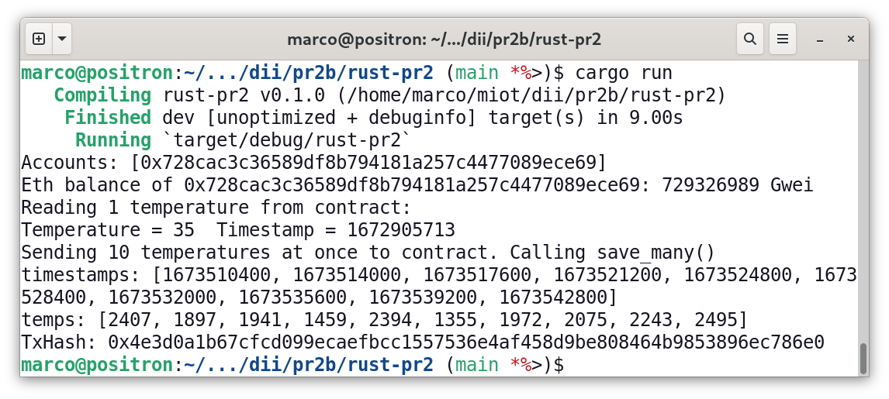
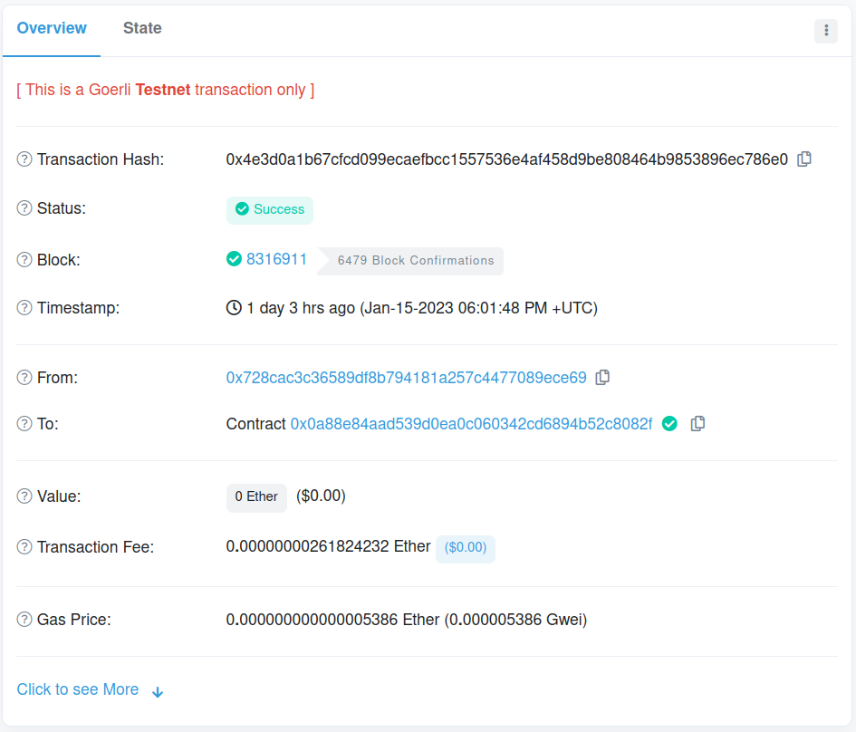
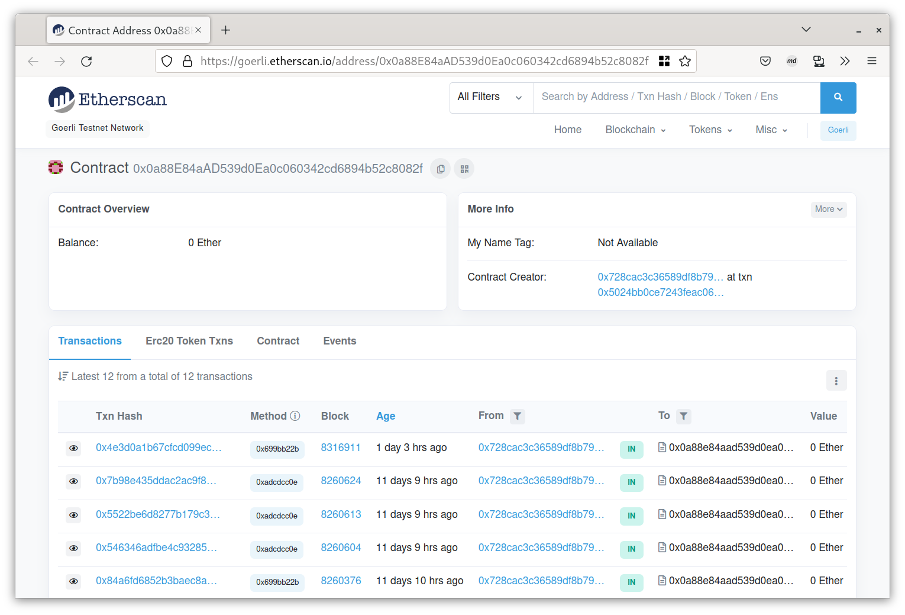
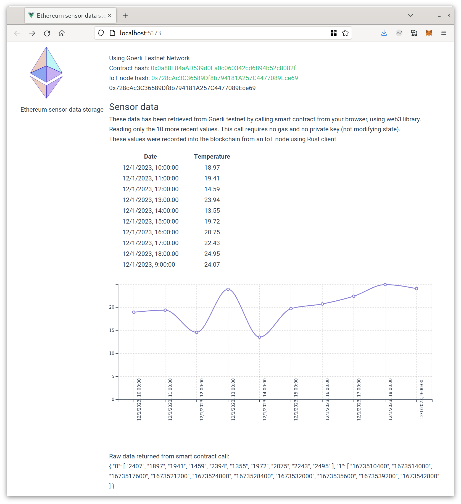

# ethsensor

- Versión online del [cliente Web con Vue](https://ethsensor.mirlo.org/)
- Contrato desplegado en Goerli Testnet:
  [hash](https://goerli.etherscan.io/address/0x0a88E84aAD539d0Ea0c060342cd6894b52c8082f)

# Código desarrollado

## Descripción del código

Se ha creado un sistema para el envío de datos desde sensores IoT a la
blockchain de Ethereum así como su monitorización en tiempo real.  Se
simula el almacenamiento de una serie de datos temporal de temperaturas.

Habitualmente los datos recogidos por los sensores en nodos IoT son
enviados a servidores donde se almacenan en bases de datos centralizadas
para su procesamiento o visualización posterior desde clientes web,
móviles, etc.  Este tipo de arquitectura es el mas eficiente y recomendado
en general.

La motivación de el sistema alternativo propuesto, utilizando blockchain,
es proporcionar trazabilidad y transparencia adicionales en casos en los
que multiples partes deben confiar en los datos recogidos y su
inalterabilidad.

Con el sistema propuesto los datos son enviados directamente a la
blockchain con transacciones que se firman previamente dentro del propio
nodo IoT. La clave privada de la identidad blockchain se almacena de forma
segura dentro del sensor, de modo que se garantiza que los datos:

- provienen únicamente del nodo y no de ninguna otra fuente (autenticidad)
- no han sido alterados con posterioridad (firmados criptográficamente)
- quedan grabados de forma indeleble (la blockchin no puede ser modificada)
- estarán siempre dispobiles al ser un sistema distribuido (alta
  disponibilidad)
  
El sistema presenta todas estas ventajas, que pueden ser muy imporante en
ciertas situaciones. Por ejemplo, un caso de uso podría ser el uso de
sensores para medir la producción de energía solar en instalaciones
distribuidas. Los datos recogidos podrían dar lugar a un comercio entre
particulares o empresas con la energía producida, con lo que dichos datos
deberían ser compartidos por todas las partes y de forma transparente y
fiable.

Los inconvenientes son claros, por lo que debe usarse solo en situaciones
que realmente requieran su uso:

- el sistema es mucho mas lento que el almacenamiento en bases de datos
- hay un coste por el envío de transacciones a la blockchain, que depende
  de la cantidad y frecuencia de datos a enviar.
- aumenta la complejidad.


## Aplicaciones

El sistema desarrollado es una prueba mínima de concepto pero contiene 3
aplicaciones que permiten demostrar su funcionamiento y viabilidad:

- **Smart contract** programado en Solidity y desplegado en la blockchain
  Goerli (testnet de Ethereum).
- **Cliente IoT** programado en Rust, que se ejecuta en el nodo sensor,
  y envía los datos al smart contract en la blockchain.
- **Cliente web** programado en javascript, para monitorizar desde cualquier
  navegador web los datos almacenados en el smart contract.

Se ha seleccionado Rust como lenguaje en el nodo por su código eficiente
tanto en tamaño de memoria como en velocidad de ejecución así como su
seguridad en la gestión de la memoria.


## Smart contract (Solidity)

El smart contract tiene como única finalidad el almacenamiento de los datos
en un array. El código completo está en el fichero `sensor.sol`.

Cada dato se compone de una huella temporal y su correspondiente
temperatura, que se almacenan en un array.  También se almacena la
identidad que despliega el contrato porque será la única autorizada para
añadir dados (en este caso el nodo, una raspberry pi).

```solidity
struct Measurement {
    uint timestamp;
    int32 temperature;
}

contract sensors {

    address raspberry;
    Measurement[] measurements;
    
    constructor() {
        raspberry = msg.sender;
    }
...
```

Para añadir datos de temperatura se pueden usar las funciones `save` (de
uno en uno, o `save_many` para guardar varios datos en una sola transacción
y ahorrar en comisiones de transacción (aunque se reduce el número de
transacciones el *gas* necesario de cada transacción aumenta al enviar mas
datos). Estas funciones serán llamadas desde el nodo IoT y requieren estar
en posesión de la clave privada de la identidad ya que modifican el estado.

```solidity
    function save(int32 temp, uint timestamp) public {
        require(msg.sender == raspberry);
        Measurement memory m;
        m.temperature = temp;
        m.timestamp = timestamp;
        measurements.push(m);
    }

    function save_many(int32[] calldata temps, uint[] calldata timestamps) public {
        require(msg.sender == raspberry);
        for (uint i = 0; i < temps.length; ++i) {
            Measurement memory m;
            m.temperature = temps[i];
            m.timestamp = timestamps[i];
            measurements.push(m);
        }
    }
```

Para la lectura de datos desde el cliente web no es necesario el uso de
clave privada, solo se requiere conocer el hash del smart contract y la
llamada es local dentro de un nodo (no requiere consenso) por lo que es
mucho mas rápida y no necesita comisión (gas).

```solidity
    function read(uint numval) public view returns (int32[] memory, uint[] memory) {
        if (numval > measurements.length) {
            numval = measurements.length;
        }
        int32[] memory temps = new int32[](numval);
        uint[] memory times = new uint[](numval);

        for(uint i = 0; i < numval; i++) {
            temps[i] = measurements[measurements.length - numval + i].temperature;
            times[i] = measurements[measurements.length - numval + i].timestamp;
        }
        return (temps, times);
    }
```

La función `clear` permite borrar (poner a cero) el array, que es
interesante si se han realizado pruebas previas. Solo el nodo podría
hacerlo.

```solidity
    function clear() public {
        require(msg.sender == raspberry);
        delete measurements;
    }
```

## Cliente en nodo IoT (Rust)

Si bien inicialmente el objetivo era utilizar un nodo ESP32-C3, que incluye
la novedosa plataforma Risc-V utilizando el nuevo soporte Rust para dicha
arquitectura, finalmente no ha sido posible y hemos optado por utilizar una
Raspberry Pi (con arquitectura ARM).

Si bien todo el programa compila sin problema, una de las librerías, la
`secp256k1`, que es necesaria para firmar las transacciones dentro del nodo
no es compatible aún con riscv. Esta librería depende a su vez de `ring`
que proporciona las rutinas criptográficas necesarias para el algoritmo de
curva elíptica.  Por desgracia algunas partes están implementadas en
ensamblador directamente para mayor rendimiento y se está trabajando
actualmente es su adaptación a riscv. Parece inminente que sea posible
compilar esta aplicación para un nodo ESP32-C3 pero aún no se puede.

El código completo puede seguirse en `rust/src/main.rs`.

Se utiliza la librería [web3](https://crates.io/crates/web3) disponible en
los repositorios de Rust. Es una implementación en Rust de la librería
web3js de javascript.

Para el envío de datos a la blockchain Goerli se utilizan los servicios de
[Infura](https://www.infura.io/). Para ello disponemos de una API key que
nos permitirá enviar transacciones. El código realiza una conexión mediante
el protocolo websocket usando la API key.

```rust
    let websocket = web3::transports::WebSocket::new(
        &env::var("INFURA_GOERLI").unwrap()).await?;
    let web3s = web3::Web3::new(websocket);
```

Las identidades de la Raspberry, su clave privada, la API key de Infura y
la identidad del smart contract se almacenan en un fichero `.env` local y
se excluyen del repositorio Git para evitar que cualquiera pueda tener
acceso a las claves privadas. Se distribuye un fichero `env-sample` que hay
que renombrar a `.env` y completar con la clave privada de la raspberry y
la clave API de Infura.

Leemos las cuentas que hay configuradas en el nodo. En este caso ninguna
porque no estamos ejecutando un nodo local. Por ello debemos añadir
manualmente la identidad de la Raspberry a la lista de cuentas.

```rust
    let mut accounts = web3s.eth().accounts().await?;
    accounts.push(H160::from_str(&env::var("RASPBERRY_ADDRESS").unwrap()).unwrap());
    println!("Accounts: {:?}", accounts);
```

Se obtiene, para cada cuenta (en realidad para la única definida, la
de la Raspberry) el balance, en unidades Gwei.

```rust
    let gwei_conv: U256 = U256::exp10(9);
    for account in accounts {
        let balance = web3s.eth().balance(account, None).await?;
        println!(
            "Eth balance of {:?}: {} Gwei",
            account,
            balance.checked_div(gwei_conv).unwrap()
        );
    }
```

Se define A partir de la dirección del contrato (que se lee desde el
fichero `.env`) se define el objeto contract para interactuar con el smart
contract desde el programa. Se indica que vamos a operar mediante la
conexión websocket abierta anteriormente con Infura, así como la definición
ABI del contrato. Esta definición en un archivo JSON que describe las
funciones del contrato y sus argumentos y valores devueltos, con todos sus
tipos.

```rust
    let contract_addr = Address::from_str(&env::var("CONTRACT_ADDRESS").unwrap()).unwrap();
    let contract = Contract::from_json(
        web3s.eth(), contract_addr,
        include_bytes!("../../solidity/erc20_sensor_abi.json")).unwrap();
```

Se lee un valor de tempertatura (y su timestamp) desde la blockchain usando
la función `read` del smart contract. Se trata de una llamada de tipo
call/query que no requiere el uso de clave privada. Se ejecutará localmente
en el nodo de Infura y no quiere consenso y por tanto el pago de ninguna
comisión.

```rust
    let result = contract.query("read", (1_u32,), None, Options::default(), None);
    let (temps, timestamps): (Vec<i32>, Vec<U256>) = result.await.unwrap();
    println!("Reading 1 temperature from contract:");
    println!("Temperature = {}  Timestamp = {}", temps[0], timestamps[0]);
```

Como vamos a ejecutar funciones que modifican el estado, es necesario
añadir la clave privada de la identidad que se va a usar como origen de la
transacción.  De nuevo, almacenada en el fichero `.env`. Idealmente, usando
un microcontrolador debería estar en una smartcard o zona segura de la
memoria flash.

```rust
    let prvk: secp256k1::SecretKey = SecretKey::from_str(
        &env::var("RASPBERRY_PRIV").unwrap()).unwrap();
```

Se utiliza la funcion `send` para enviar un unico valor de tiempo y
temperatura en una sola transacción. Se crea la transacción usando la
funcion signed_call, que compilará el código necesario para la EVM y la
firmará con la clave privada anterior. Infura solo aceptará la transacción
si va ya firmada porque en Infura no está nuestra clave privada. Nuestra
clave privada la guardamos solo localmente, naturalmente.

Obtemenos el hash de la transacción, lo que permite seguir su progreso en
la web [Etherscan](https://goerli.etherscan.io/). Existe la posibilidad de
seguir el progreso de la transacción desde el propio código, de forma
asíncrona. No se hace para mantener el código sencillo y legible.

También es posible obtener una estimación del (gas_price), así como del
coste de la llamada (gas) para garantizar el éxito de la transacción en un
tiempo razonable. En este caso se hace una estimación manual por prueba y
error, que no es muy óptimo por que el precio varia bastante según el
momento.

```rust
    // Send one single temperature and timestamp to smart contract
    println!("Sending 1 temperature to contract. Calling save()");
    let tx = contract
        .signed_call("save", (35_i32, 1672905713_u32),
                     Options::with(|opt| opt.gas = Some(2_000_000.into())),
                     SecretKeyRef::new(&prvk))
        .await.unwrap();
    println!("TxHash: {:#x}", tx);
```

A continuación se generan 10 valores de tiempo equiespaciados 1h desde el
día 12/01/2023 9:00:00 y 10 valores aleatorios de temperatura entre 13ºC y
26ºC.  Por convenio, ya que no se pueden almacenar números decimales (coma
flotante) en la blockchain, se almacenarán centésimas de grado centígrado
como número entero.

```rust
    let start = 1673510400_u32;
    let timestamps: Vec<u32> = (0..10).map(|i| start + i * 3600).collect();

    let mut rng = rand::thread_rng();
    let temps: Vec<i32> = (0..10).map(|_| rng.gen_range(1300..=2600)).collect();
    println!("timestamps: {:?}", timestamps);
    println!("temps: {:?}", temps);
```

Finalmente se envía en 1 sola transacción firmada el array de 10 temperaturas.

```rust
    let result = contract
        .signed_call("save_many", (temps, timestamps),
                     Options::with(|opt| {
                         opt.gas = Some(4_000_000.into());
                         //opt.gas_price = Some(20_000_000_000.into());
                     }), SecretKeyRef::new(&prvk))
        .await;
    match result {
        Ok(tx) => println!("TxHash: {:#x}", tx),
        Err(error) => panic!("Error en transacción: {:?}", error),
    }
```


## Cliente web (javascript / Vuejs)


El cliente javascript está realizado con la librería
[Vue.js](https://vuejs.org/). Cuando se accede al servidor web se descarga
la aplicación con todo el código javascript, que se ejecuta en el navegador
cliente. Todas las conexiones se realizarán directamente desde el navegador
a la API de Infura. Mediante esta API se ejecutarán llamadas tipo "call()"
para leer la blockchain, por lo que en ningún momento se necesitan claves
privadas (sería un riesgo enviarlas al navegador).

Es importante que la conexión se haga desde el navegador de forma directa y
no desde el servidor web, ya que solo así se puede tener la seguridad de
que el valor mostrado es realmente el que hay en la blockchain y no ha
podido ser alterado.

Se muestran únicamente los fragmentos en los que se produce la interacción
con la blockchain. El código completo puede seguirse en el directorio `vue/`
y mas concretamente en `vue/src/components/SensorEth.vue`.

Análogamente al caso del cliente Rust, inicializamos la libería
web3 de javascript con la identidad de la Raspberry, hash del
smart contract y API key de Infura.

Se define la funcion read_sensor() que conecta con Infura,
lee los 10 últimos valores escritos en el smart contract llamando
a la funcion `read(10)`.


```javascript
import Web3 from 'web3'
import abi from '../assets/erc20_sensor_abi.json';

// https://blog.logrocket.com/integrate-web3-into-vue/

const INFURA_API_KEY = '<insertar-aqui-API-key-infura>'
const CONTRACT_ADDRESS = '0x0a88E84aAD539d0Ea0c060342cd6894b52c8082f';
const RASPBERRY_ADDRESS = '0x728cAc3C36589Df8b794181A257C4477089Ece69';

export default {

  async read_sensor() {

    const provider = new Web3.providers.HttpProvider(
      `https://goerli.infura.io/v3/${INFURA_API_KEY}`);
    const web3 = new Web3(provider);

    // contrato al que se va a llamar
    const contract_addr = CONTRACT_ADDRESS;
    // Loading the contract ABI
    const myContract = new web3.eth.Contract(abi, contract_addr);
    // dirección desde la que se hace la llamada (opcional, transacción local)
    const fromaddr = RASPBERRY_ADDRESS;

    // Some example calls how to read data from the smart contract

    const data = await myContract.methods.read(10).call({from: fromaddr});
    console.log('data read', data);
    return data;

  },
}
```


# Pruebas realizadas

El contrato ha sido desplegado manualmente (aunque se podría hacer desde
javascript o Rust) utilizando el IDE web
[Remix](http://remix.ethereum.org/)

Se copia y pega el contenido del fichero `sensor.sol` que contiene el smart
contract en el IDE. A continuación se compila y se copia el ABI generado
por Remix para su utilización por las aplicaciones clientes.  Todas estas
operaciones se pueden realizar localmente con el compilador de Solidity
también.

Se depliega en contrato utilizando extensión de Firefox Metamask. Para ello
se ha obtenido previamente saldo en
[Goerli Faucet](https://goerlifaucet.com/)
Se utiliza la misma identidad que se va a configurar en la Raspberry Pi.
Anotamos el hash asignado al contrato para introducirlo en las aplicaciones
Rust y javascript, en los ficheros .env.

No se describen estos pasos con mas detalle porque son análogos a la
práctica número 1.

A continuación se ejecuta el programa en Rust para introducir 10 valores
aleatorios de temperatura en el smart contract. Ver @fig:rustexec

{#fig:rustexec width=70%}

Se obtiene el hash de la transacción y comprobamos en etherscan.io que
se completa correctamente transcurridos unos segundos (@fig:transaccion).
También vemos el listado de todas las transacciones realizadas en el
contrato con las diversas pruebas realizadas (@fig:contrato).

{#fig:transaccion width=70%}

{#fig:contrato width=100%}

La aplicación cliente en javascript nos permite visualizar los valores que
han sido añadidos consultando la blockchain. Esta aplicación se puede
ejecutar manualmente como se describe en el siguiente apartado.  Sin
embargo, para facilitar su uso se ha instalado una instancia en un servidor
web, al que se puede acceder directamente ahora mismo para ver los datos:
[cliente web ehtsensor](https://ethsensor.mirlo.org) en
`https://ethsensor.mirlo.org`.

{#fig:vueapp width=100%}


# Guia de la aplicación

## Cliente Rust

La aplicación Rust se debe compilar para poder ejecutarla. Para ello es
necesario tener instalado el compilador de Rust.

Rust y todo su toolchain (compilador, depurador, gestor de dependencias
*cargo*, etc) se instalan mediante el gestor de versiones de Rust, llamado
*rustup*. En Linux:

    curl --proto '=https' --tlsv1.2 -sSf https://sh.rustup.rs | sh
    rustup install nightly

A continuación clonar el repositorio de la aplicación, cambiar a la
carpeta con el cliente Rust y compilar el programa:

    git clone https://github.com/marcormc/ethsensor
    cd rust
    cargo build

Copiar el ejemplo de configuración y modificarlo para incluir la API key de
Infura, así como la clave privada de la identidad de la Raspberry. Estos 2
datos no se han incluido en el repositorio.

    cp env-sample .env
    # edit file .env

Por útlimo, ejecutar el programa:

    cargo run

## Aplicación javascript / Vue

Con el mismo repositorio, cambiar al directorio vue. Es necesario tener
instalado Node y Npm para gestionar las dependencias javascript, ejecutar
localmente un servidor de desarrollo o generar un paquete para producción
en servidor web.

    cd vue
    npm install
    
Ejecutar un servidor local de desarrollo:

    npm run dev
    
La aplicación estará accesible en `http://localhost:8000`.
    
Para empaquetar para producción:

    npm run build
    
Copiar el contenido de la carpeta `build/` al servidor de producción.


# Referencias

- [Solidity documentation](https://docs.soliditylang.org/en/latest/)
- [Solidity by Example](https://docs.soliditylang.org/en/latest/solidity-by-example.html)
- [Remix - Ethereum IDE](http://remix.ethereum.org/)
- [Web3.js — Javascript Ethereum API](https://web3js.org/#/)
- [Sending Ethereum Transactions with Rust - kauri.io](https://kauri.io/#collections/A%20Hackathon%20Survival%20Guide/sending-ethereum-transactions-with-rust/)
- [Rust Web3 connect to Ethereum blockchain - TMS Developer Blog](https://tms-dev-blog.com/rust-web3-connect-to-ethereum/)
- [tomusdrw/rust-web3: Ethereum JSON-RPC multi-transport client. Rust implementation of web3 library](https://github.com/tomusdrw/rust-web3)
- [Ethereum for Rust developers | ethereum.org](https://ethereum.org/en/developers/docs/programming-languages/rust/)


# Repositorio Git


Repositorio Git del proyecto ethsensor disponible en:

    https://github.com/marcormc/ethsensor
